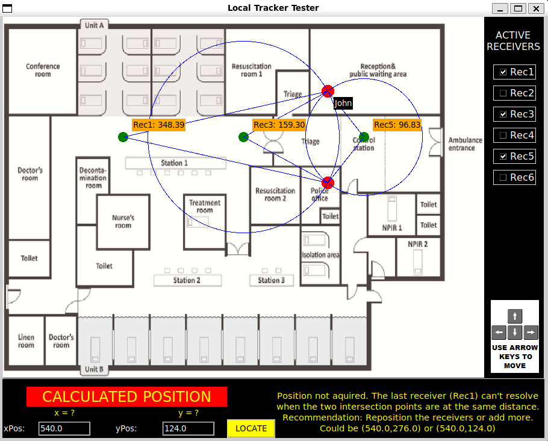

# Local Tracker Simulator

This Python script implements a system to locally track a device by triangulating its position. The testing script uses the `tkinter` library to visualize the tracking system over a moving object.

## Summary

We are operating in the emergency unit of a large hospital in a city that experiences significant seasonal flu outbreaks. As the flu overwhelms hospital staff, resources become strained, leading to longer waiting times and frustrated patients. With limited communication, patients often wander the hallways in search of assistance, inadvertently leaving designated areas or entering restricted zones. The complex layout of the hospital exacerbates the situation, making it easy for patients, especially those unfamiliar with the hospital, to get lost.

While tracking patients alone won't resolve all these challenges, implementing a local tracking system can significantly improve patient flow, help staff locate individuals quickly, and ultimately reduce waiting times. This will ease the strain on hospital operations and improve the overall patient experience.

## Objective

The goal of this project is to develop a local tracking system that uses triangulation methods to determine the position of an object within a confined area.

## Implementation Details

Each patient will be provided with an RF (radio frequency) tracker in the form of a bracelet. Several receivers, strategically placed throughout the hospital, will measure the distance between the tracker and themselves. These measurements will be processed using a triangulation algorithm to determine the patient's precise location in real-time.

The tracking process works as follows:

1. **Distance Measurement**: Each available receiver measures the distance to the tracked patient. Since the precision of the receivers decreases with distance, closer receivers will be prioritized to ensure the highest accuracy in calculations. In other words, sort the measurement list and take the lowest values.
   
2. **Defining the Location**:
   - The first receiver’s measurement defines a circle, with the tracker’s location somewhere on its perimeter.
   - The second receiver defines another circle, which intersects with the first. This intersection narrows down the tracker’s location.
   
3. **Data Validity**:
   - If the two circles do not intersect, it indicates that the receivers are out of range or that there is a malfunction. In such cases, the algorithm cannot determine the position.
   - In the rare case that the two circles intersect at only one point (i.e., they are tangent), the tracker’s position can be determined without additional data.
   
4. **Multiple Intersections**: 
   - Typically, the two circles will intersect at two points. A third receiver’s data is used to decide which of the two points is the correct location.
   
5. **Receiver Distribution**:
   - Depending on the distribution of the receivers (e.g., if three receivers are aligned), it is possible that the third receiver may not be able to distinguish between the two candidate points. In such cases, additional iterations using data from other receivers will be necessary to resolve the correct location.

## Instructions
Clone the git repository:

```
git clone https://github.com/masintxi/local_tracker
```

Assuming python is already installed, install `tkinter` using `pip`:

```
pip install tk
```

Run the `local_tracker_tester.py` script:

```
python3 local_tracker_tester.py
```

A window will pop up showing the layout of a hospital.



### Interaction:
- **Tracker Movement**: The movement of the tracker can be simulated using the keyboard arrow keys.
- **Receiver Status**: The three (or two) receivers used to calculate the tracker's position will be displayed in **orange**, while the other receivers will appear in **green**.
- **Coordinate Input**: At the bottom of the window, you can input specific XY coordinates to simulate tracking a concrete position.
- **Receiver Control**: On the right side of the window, you can activate or deactivate any of the 6 receivers to simulate different receiver configurations.
